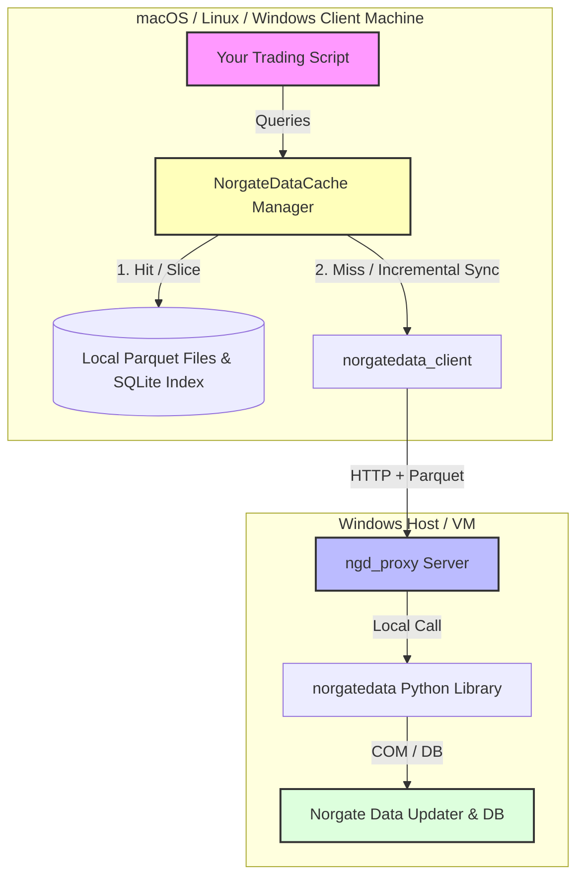

# Proposal: Norgate Data Proxy with Isolated Client-Side Cache (`ngd_proxy`)

To enable seamless, high-performance access to Windows-only Norgate Data from **macOS, Linux, and Windows**, we propose a client-server proxy combined with a sophisticated, isolated **Client-Side Caching Layer** that supports prices, historical index constituents, and fundamental datasets.



---

## User Review Required

> [!IMPORTANT]
> **Unified Timeseries Caching Engine**
> - Norgate Data includes historical index memberships (`index_constituent_timeseries`), dividend yields, exchange listings, and capital events.
> - To support these seamlessly, the local caching layer will be a **Unified Timeseries Caching Engine**.
> - Every timeseries query will be stored as a Parquet file named by its namespace (`datatype`), `symbol`, and `parameter` (e.g., adjustment setting or index name).
> - **Smart Range Merging** will apply equally to all these datasets. For example, if you check index membership for `AAPL` in the `S&P 500` up to last month, a new query up to today will only fetch and append the missing days!

> [!TIP]
> **Eviction & Handling "Dead" Symbols**
> - **Default Policy:** We will set the default eviction policy to **LRU (Least Recently Used)**.
> - Since both LRU and LFU are supported, LRU is ideal here: if a symbol is delisted or "dead" (and thus no longer queried), it will naturally migrate to the bottom of the cache access queue and be cleanly pruned when the cache size limit is reached.

---

## Configuration & Defaults

We will bundle a `config.json` file on the client side with explicit default values for every setting. No configuration values will be left "missing".

#### [NEW] [config.json](file:///c:/Projects/claudeai/gemini/ngd_proxy/config.json)
```json
{
  "server_base_url": "http://127.0.0.1:8000",
  "api_key": "norgate-secure-default-key-replace-me",
  "cache_enabled": true,
  "cache_dir": "~/.cache/norgatedata",
  "max_cache_size_mb": 10000,
  "eviction_policy": "LRU",
  "refresh_expired_days": 1
}
```
*Note: The client will automatically resolve `~` to the user's home directory across Windows, macOS, and Linux.*

---

## Proposed Changes

### 1. Client-Side Components (macOS / Linux)

#### [NEW] [client.py](file:///c:/Projects/claudeai/gemini/ngd_proxy/client.py)
A lightweight HTTP client that queries the Windows server. It automatically deserializes Parquet formats into Pandas DataFrames and preserves high performance.

#### [NEW] [norgatedata_cache.py](file:///c:/Projects/claudeai/gemini/ngd_proxy/norgatedata_cache.py)
The core **Unified Timeseries Cache Manager**. It coordinates SQLite index tracking and Parquet file updates.
- **SQLite Database Schema (`cache_index.db`):**
  ```sql
  CREATE TABLE cache_metadata (
      datatype TEXT,          -- 'price', 'index_constituent', 'dividend_yield', etc.
      symbol TEXT,            -- e.g. 'AAPL'
      parameter TEXT,         -- e.g. 'TOTALRETURN' or 'S&P 500'
      start_date TEXT,        -- YYYY-MM-DD
      end_date TEXT,          -- YYYY-MM-DD
      file_path TEXT,
      file_size INTEGER,
      last_accessed_at TIMESTAMP,
      access_count INTEGER,
      PRIMARY KEY (datatype, symbol, parameter)
  );
  ```
- **Unified Cache API:**
  - `price_timeseries(symbol, stock_price_adjustment_setting, start_date, end_date, ...)`
  - `index_constituent_timeseries(symbol, indexname, start_date, end_date, ...)`
  - `dividend_yield_timeseries(symbol, start_date, end_date, ...)`
  - `major_exchange_listed_timeseries(symbol, start_date, end_date, ...)`
  - `watchlist(watchlistname)`, `watchlist_symbols(watchlistname)`, `watchlists()` (cached for 24 hours to keep updates fast).

---

### 2. Backend Server Component (Windows Host)

#### [NEW] [server.py](file:///c:/Projects/claudeai/gemini/ngd_proxy/server.py)
FastAPI server serving price, constituent membership, fundamentals, and watchlists. Fully supports range queries to allow incremental client updates.

#### [NEW] [requirements.txt](file:///c:/Projects/claudeai/gemini/ngd_proxy/requirements.txt)
Required python packages:
- Server: `fastapi`, `uvicorn`, `pandas`, `pyarrow`, `psutil`
- Client: `pandas`, `pyarrow`, `requests`, `cryptography`

---

## Verification Plan

### Automated Tests (`test_cache.py`)
1. **Price Timeseries Cache Test:** Miss, full hit, and incremental sync merge.
2. **Index Constituent Cache Test:**
   - Fetch `AAPL` in `S&P 500` index membership for 2020-2025.
   - Assert cache file exists.
   - Fetch range extending to 2026, assert only delta is requested from the mock server.
3. **Eviction Limit Test:** Run a loop inserting 10 synthetic symbols, setting `max_cache_size_mb` to a small value, and checking that the oldest or least-frequently-used files are automatically deleted.

### Manual Verification
- Measure loading speeds: HTTP fetch vs. cached Parquet disk load.
